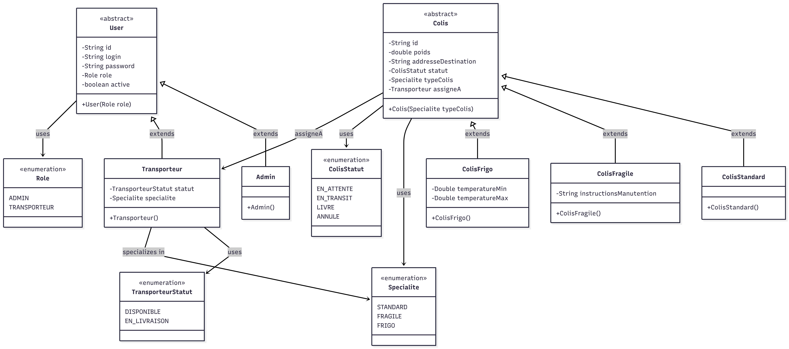

# Colis System - Logistics Management Application

A modern Spring Boot application designed to modernize package management systems for logistics operations.

## 🎯 Overview

Colis System is a comprehensive logistics management application built with Spring Boot 3.5.7 and MongoDB. It provides a complete solution for managing packages (colis) with different specifications (standard, fragile, refrigerated) and carrier assignments.

## 🏗️ Architecture

The application follows a layered architecture pattern:

- **Controller Layer**: REST API endpoints
- **Service Layer**: Business logic implementation
- **Repository Layer**: Data access with Spring Data MongoDB
- **Model Layer**: Domain entities and enums
- **Security Layer**: JWT authentication and authorization
- **DTO Layer**: Data transfer objects for API requests/responses
- **Exception Handling**: Global exception handling with custom exceptions

## 📊 Class Diagram



### Model Relationships

- **User Hierarchy**: 
  - `User` is an abstract base class
  - `Admin` and `Transporteur` extend `User`
  - Each user type has a specific `Role`

- **Colis Hierarchy**:
  - `Colis` is an abstract base class
  - `ColisStandard`, `ColisFragile`, and `ColisFrigo` extend `Colis`
  - Each package type has a specific `Specialite`
  - Packages can be assigned to a `Transporteur`

- **Enumerations**:
  - `Role`: ADMIN, TRANSPORTEUR
  - `Specialite`: STANDARD, FRAGILE, FRIGO
  - `ColisStatut`: EN_ATTENTE, EN_TRANSIT, LIVRE, ANNULE
  - `TransporteurStatut`: DISPONIBLE, EN_LIVRAISON

## 🛠️ Technologies

- **Java 17**
- **Spring Boot 3.5.7**
- **Spring Data MongoDB** - NoSQL database integration
- **Spring Security** - Authentication and authorization
- **JWT (java-jwt 4.4.0)** - Token-based authentication
- **Lombok** - Reduce boilerplate code
- **SpringDoc OpenAPI 2.8.5** - API documentation
- **MongoDB** - NoSQL database
- **Maven** - Dependency management and build tool
- **Docker** - Containerization support

## 📦 Prerequisites

- Java 17 or higher
- Maven 3.6+
- MongoDB 4.0+ (or Docker for containerized MongoDB)
- Docker & Docker Compose (optional, for containerized deployment)

## 🚀 Installation

1. **Clone the repository**
   ```bash
   git clone https://github.com/saadelquaul/colis-system.git
   cd colis-system
   ```

2. **Configure MongoDB**
   
   Option A: Local MongoDB
   - Install MongoDB locally
   - Start MongoDB service on port 27017
   
   Option B: Docker MongoDB
   ```bash
   docker-compose up -d
   ```

3. **Build the project**
   ```bash
   ./mvnw clean install
   ```

## ⚙️ Configuration

Update `src/main/resources/application.properties`:

```properties
# Application Name
spring.application.name=colis-system

# MongoDB Configuration
spring.data.mongodb.uri=mongodb://localhost:27017/colis_db

# JWT Configuration
jwt.secret=YOUR_SECRET_KEY_HERE
jwt.expiration=86400000  # 24 hours in milliseconds

# Logging
logging.level.org.springframework.security=DEBUG
```

⚠️ **Important**: Change the `jwt.secret` to a secure value before deploying to production.

## 🏃 Running the Application

### Using Maven
```bash
./mvnw spring-boot:run
```

### Using Java
```bash
java -jar target/colis-system-0.0.1-SNAPSHOT.jar
```

### Using Docker
```bash
docker-compose up
```

The application will start on `http://localhost:8080`

## 📚 API Documentation

Once the application is running, access the interactive API documentation:

- **Swagger UI**: http://localhost:8080/swagger-ui.html

### Main API Endpoints

- **Authentication**
  - `POST /api/auth/login` - User login
  - `POST /api/auth/register` - User registration

- **Admin Operations**
  - `GET /api/admin/users` - List all users
  - `PUT /api/admin/users/{id}/activate` - Activate/deactivate user

- **Colis Management**
  - `GET /api/colis` - List all packages
  - `POST /api/colis` - Create new package
  - `PUT /api/colis/{id}` - Update package
  - `DELETE /api/colis/{id}` - Delete package
  - `PUT /api/colis/{id}/assign` - Assign package to carrier

- **Transporteur Operations**
  - `GET /api/transporteurs` - List all carriers
  - `PUT /api/transporteurs/{id}/status` - Update carrier status

## 📁 Project Structure

```
colis-system/
├── src/
│   ├── main/
│   │   ├── java/com/logistique/colis_system/
│   │   │   ├── config/          # Configuration classes
│   │   │   ├── controller/      # REST controllers
│   │   │   ├── dto/             # Data Transfer Objects
│   │   │   ├── exception/       # Custom exceptions
│   │   │   ├── mapper/          # Entity-DTO mappers
│   │   │   ├── model/           # Domain entities
│   │   │   │   └── enums/       # Enumerations
│   │   │   ├── repository/      # Data repositories
│   │   │   ├── security/        # Security configuration
│   │   │   └── service/         # Business logic services
│   │   └── resources/
│   │       └── application.properties
│   └── test/                    # Unit and integration tests
├── docker-compose.yml           # Docker compose configuration
├── Dockerfile                   # Docker image definition
├── pom.xml                      # Maven configuration
└── README.md                    # This file
```

## 🔒 Security

The application implements JWT-based authentication:

1. **Login**: Users authenticate with credentials
2. **Token Generation**: JWT token is generated upon successful login
3. **Authorization**: Protected endpoints require valid JWT token in Authorization header
4. **Role-based Access**: Different endpoints accessible based on user role (ADMIN/TRANSPORTEUR)

### Default Users

On application startup, default users are created (via DataSeeder):
- **Admin User**: Check the DataSeeder configuration
- **Test Transporteur**: Check the DataSeeder configuration

## 🧪 Testing

Run tests with Maven:
```bash
./mvnw test
```


#
 **Saad El Quaul** - [GitHub](https://github.com/saadelquaul)

---

